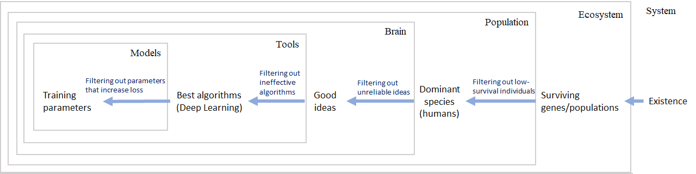

# Principles of Intelligence - Primary Intelligence and Secondary Intelligence

**This page is translated by ChatGPT.**

In everyday context, there are various definitions or descriptions of what intelligence is: cognitive ability, predictive ability, ability to seek advantage and avoid harm, and the ability to transform the world through actions. None of these descriptions constitute a good definition. A system with simple predictive and action capabilities alone cannot reach the level of intelligence, nor does it need omniscient predictive and action capabilities to be considered intelligent. So what do intelligent systems cognize, predict, and transform?

In contrast, seeking advantage and avoiding harm is a more precise definition, as it clearly defines the direction of prediction and action. The only drawback is the lack of clarity in defining advantage and harm. As the saying goes, "what is poison to one, may be honey to another"; judgments of advantage and harm vary with circumstances, which depend on the attributes, environment, and purpose of each thing. Upon deeper examination, it is not difficult to find that the only indivisible and difficult-to-define aspect at the core of these definitions is "purpose". As long as a system has a purpose, its processes of cognition, prediction, and action can be considered intelligent. Therefore, we can boldly assume:

```text
Intelligent systems all have purposes, and systems with purposes can be called intelligent systems.
```

Although purpose remains difficult to define, fortunately, predecessors have provided a relatively clear expression. Aristotle described the operation of the world with the Four Causes: material cause, formal cause, efficient cause, and final cause. Modern natural science has thoroughly researched the first three causes, while the academic community still holds skepticism and criticism towards the final cause, because the definition of purpose itself is unclear. Teleology often evades the exploration of purpose itself by borrowing the unknowable ultimate purpose. Aristotle's explanation of this is that the final cause is "the tendency of things with an end to choose the best end", where what is considered good belongs to a highly subjective topic.

But what we can certainly clarify is that for any entity, not reaching an end is certainly not the best end. Therefore, we borrow Aristotle's definition:

**Definition**

```text
Purpose: The tendency of things to avoid reaching an end.
```

This definition still adheres to the teleological paradigm, and for the subjective aspect within it, further explanation is required. It is well-known that almost all entities inevitably deteriorate over time. The idea of avoiding decay is merely a cognitive bias, much like an airplane hit by a bullet – those that have decayed have already disappeared, and only the portion that successfully avoids decay is visible to us.

**Equivalent Definition**

```text
Purpose: For all entities that are destined for an end, due to the unobservable nature of the decayed portion, the observable portion manifests a similar tendency.
```

Based on this, we define an intelligent system:

**Definition**

```text
Intelligent System: A system with a purpose ⇔ A system in which the observable portion exhibits a tendency to evade decay due to the unobservable decayed portion.
```

## Primary Intelligence

It can be observed that the definition of intelligence here is almost identical to evolution. We refer to this intelligence that directly arises from decay as primary intelligence.
*Note that the concept of primary intelligence is not well-defined; this classification is only used for the convenience of understanding by readers.*

Below are some examples.

| Intelligent System | Intelligent Behavior | Purpose |
|---|---|---|
| Light | Fermat's Principle: Light always propagates along the path that requires the shortest time in a medium | Waves propagating in other directions are canceled out due to interference |
| Evolutionary system | Biological evolution appears as active adaptation to the environment, survival of the fittest | Organisms unable to adapt to the environment become extinct |
| Slime molds | 1. Slime molds can find food in a maze using the shortest path.<br>2. When placed with food arranged according to human urban locations, slime molds form connectivity diagrams consistent with human transportation networks | Slime molds extend their cytoplasm and retract excess portions upon finding food. Simultaneously, they contract distant paths to expand nearby paths, optimizing the food transport network. |
| Prophecy Scam | 1. Accurate predictions of the outcome of every match.<br>2. Highly accurate predictions online | Only accurate predictions survive. Scammers send match results randomly to tens of thousands of people, retaining only the correct predictions after each match and continuing to send predictions for the next match. To the retained recipients, the scammer appears to be a deity of 100% accurate predictions. |

Formally, we denote the behavior selection of an individual $\pi$ under the system state $s^t$ at time $t$ as $P(s_{\pi}^{t+1}|s_{\pi}^t)$.
The probability expression over time can be written as $P(s_{\pi}^{t+1}|s_{\pi}^t)P(s_{\pi}^{t+2}|s_{\pi}^{t+1})...P(s_{\pi}^n|s_{\pi}^{n-1})$.
The conditional probability $P(s_{\pi}^n|s_{\pi}^t)$ of $\pi$ transitioning from $s^t$ to $s^n$ can define a partial order set.
If there exists a function $S(s_{\pi}^n) \cong P(s_{\pi}^n|s_{\pi}^t)$ that is order-preserving with respect to this set,
we call $S(s_{\pi}^n)$ the objective function of $\pi$, and $P(s_{\pi,alive}^n)$ is the actual objective function, which can be termed as the real objective function.
Then $P(s_{\pi}^{t+1}|s_{\pi}^t,s_{\pi,alive}^n)$ is considered more intelligent than $P(s_{\pi}^{t+1}|s_{\pi}^t)$.

Note: The use of uppercase S notation for the objective function here is because the right-hand side, like entropy, is defined by probability in the direction of time.
The two should be able to constitute some kind of equivalent definition.
Under the Boltzmann entropy definition, $S=k\ln\Omega$ , $P(s_{\pi}^{n_i}) = \frac{\Omega_i}{\sum_{i}{\Omega_i}} = \frac{e^{S_i/k}}{\sum_{i}{e^{S_i/k}}}$.
Due to the lack of systematic learning in statistical thermodynamics, I'm not confident in this conclusion.


## Secondary Intelligence

Entities such as the aforementioned primary intelligence may be considered as pseudo-intelligence because they are merely manifestations of underlying mechanisms at work.

Now, let's delve into the truly complex and brilliant intelligence found in everyday contexts.

In complex and ever-changing real environments, individuals who can adopt the correct strategies as the environment changes always have a better chance of survival than those who cannot change their behavior. Therefore, individuals who successfully survive in evolution usually possess the ability to actively adapt to or even transform the environment. They can utilize other parts of the environment to enhance their survival capabilities. These individuals improve their chances of survival by selecting useful components from the environment, thereby promoting the evolution of more intelligence.

If there are two individuals $\pi$ and $\phi$ in a system, and their probability of survival together in evolution is higher than surviving alone, forming a kind of symbiotic relationship, that is, $P(s_{\pi,alive}^n s_{\phi,alive}^n | s_{\pi}^t s_{\phi}^t) \gt P(s_{\pi,alive}^n|s_{\pi}^t s_{\phi}^t)P(s_{\phi,alive}^n|s_{\pi}^t s_{\phi}^t)$, it is not difficult to prove that $P(s_{\phi,alive}^n | s_{\pi}^t s_{\phi}^t s_{\pi,alive}^n) \gt P(s_{\phi,alive}^n | s_{\pi}^t s_{\phi}^t)$, which means that the presence of $\pi$ can increase the probability of survival for $\phi$. Thus, the existence of $\pi$ will exert selection pressure on $\phi$, leading to the emergence of new intelligence under this selection pressure. Similarly, we can define $S_{\pi}(s_{\phi}^n) \cong P(s_{\phi}^{n}|s_{\pi}^t s_{\phi}^t s_{\pi,alive}^n)$ as the expected objective function of $\pi$ for $\phi$.

In simpler terms, intelligent agents can purposefully use other entities in the environment as tools. In such usage, intelligent agents select their tools. Useful tools not only help intelligent agents achieve their goals but also increase their own chances of survival, leading to the development of new intelligent entities.

The key difference between secondary intelligence defined here and primary intelligence defined earlier is that while primary intelligence achieves intelligence through equiprobable sampling selection throughout the entire state space, secondary intelligence achieves sampling selection under the condition probability defined by existing intelligence. Therefore, such intelligence emerges much faster and is much stronger in its intelligence level.

Among these, two points are worth noting. Firstly, the evolutionary condition of secondary intelligence is actually a symbiotic relationship. This relationship is mutual, where the existence of both entities mutually satisfies each other's needs and conducts selection on each other. It's similar to how humans select and use sharp knives as tools, leading the knives to become sharper over time. For the knives, only those humans who are good at using tools can better ensure their survival.

Secondly, the expected objective function of $\pi$ for $\phi$, denoted as $S_{\pi}(s_{\phi}^n) \cong P(s_{\phi}^{n}|s_{\pi}^t s_{\phi}^t s_{\pi,alive}^n)$, the objective function of $\phi$ itself, denoted as $S(s_{\phi}^n) \cong P(s_{\phi}^n|s_{\phi}^t)$, and the actual objective function $P(s_{\phi,alive}^n)$ are highly correlated, but they actually have no inherent causal relationship. The correlation between the first two depends on the correlation between $P(s_{\pi,alive}^n|s_{\pi}^t s_{\phi}^t)$ and $P(s_{\phi,alive}^n|s_{\pi}^t s_{\phi}^t)$, or from a different perspective, it can be referred to as the degree of symbiosis, degree of aligned interests, coupling degree, or information interaction degree (the necessary but not sufficient condition for strong information interaction between different entities in a localized stochastic system). The actual objective function $P(s_{\phi,alive}^n)$ cannot be fully measured.

In our theoretical framework, every form of intelligence either arises from the random evolution of the system or from the purposeful selection by other intelligent entities. We can trace a purpose transmission chain for any intelligence, starting from itself and retracing back to the ultimate purpose of "existence". Here, let's take artificial intelligence, which is of great concern to everyone, as an example for analysis:



As the means-end chain grows, it can be observed that with each layer, the deviation of the intelligence's purpose from the original purpose becomes increasingly distant, and may even become completely unrelated.

## Conclusion

In this section, we have shifted our perspective on intelligence, using a reverse causation approach, which successfully completely eliminates subjective factors from intelligence, explaining the principles behind the birth and operation of intelligent systems.

In this perspective, we have two important intuitions about intelligent systems:

1. Regarding the complex problem of how to exist, intelligence actually continuously eliminates incorrect answers with the help of evolution or other forms of selection. It accomplishes an approximate solution to the problem of existence by continuously approaching its contrapositive proposition. This is a way of reasoning that is very intuitive in mathematics – when solving a problem directly becomes too difficult, the contrapositive proposition may provide a simpler solution.

2. The key reason why intelligent systems cannot achieve omniscience and omnipotence lies in the gap between the objective function and the actual objective function. One of the reasons for this gap is that the actual objective function cannot be accurately measured, and we can only continuously approximate its solution, but there will always be errors. The other reason is the limited information exchange between two individuals, leading to the independence of individuals and the accumulation of errors in the transmission of objectives along the chain, ultimately resulting in distortion of the objectives.

These two points provide important clues for us on how to purposefully construct powerful intelligent systems.
