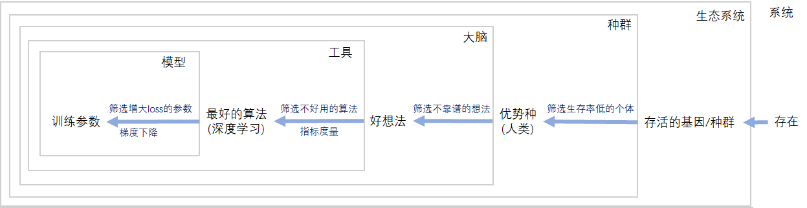

# 智能原理——原生智能与次生智能

在日常语境下，对于什么是智能，我们有多种定义或者说形容方式：认知能力、预测能力、趋利避害能力、改造世界的行动能力。
这些形容都不是良定义的，一个系统有着简单的预测和行动能力并不能达到智能的程度，而它也无需有全知全能的预测和行动才能被称得上智能。
所以智能系统在认知什么、预测什么、改造什么呢？

相比之下趋利避害是一个更精确的定义，它明确了预测和行动的方向，唯一不足的是对利害的定义尚不明确。
正所谓彼之砒霜、汝之蜜糖，利害判定随事物而不同，这与每件事物的属性、环境、目的有关。
深究不难发现这些定义在底层唯一不可拆分、难以定义的部分就是“目的”。
只要是有目的的系统，其认知、预测、行动的过程都可以被认为是智能的。因此我们可以大胆假设：

```text
智能系统都具有目的，有目的的系统都可以被称作智能系统。
```

尽管目的依旧很难定义，幸运的是，已有前人帮我们给出了一个相对清晰的表述。
亚里士多德将世界运作由四因说表述：质料因、形式因、动力因、目的因。
对前三种因素现代自然科学已经有了充分的研究，对于目的因学界仍保持着质疑和批判，这是因为目的本身定义的不清晰，目的论假借不可知的终极目的逃避了对目的本身的探讨。
对此亚里士多德的解释是“目的因是具有终结的事物选择最善的终结的倾向”，其中什么是善属于非常主观的话题。

但我们一定可以明确的是，对任何事物而言，不终结一定是最好的终结。因此我们借用亚里士多德的定义：

**定义**

```text
目的：事物避免走向终结的运动倾向
```

这个定义依然是目的论范式的，对于其中的主观部分，我们需要进一步解释。
总所周知几乎所有事物都在不可避免地走向衰亡，所谓避免衰亡只是一种认知偏差，正如被子弹击中的飞机一样——
那些衰亡的事物都已经消失了，只有成功避免了衰亡的那部分才能被我们看见。

**等价定义**

```text
目的：所有会走向终结的事物，由于已经衰亡的那部分不被观测，导致可观测部分具有相同运动倾向的表象
```

在此基础上我们定义智能系统：

**定义**

```text
智能系统：具有目的的系统 ⇔ 由于已衰亡部分不被观测，使得可观测部分具有躲避衰亡趋势的系统
```


## 原生智能

可以看出此处智能的定义与演化几乎相同，我们将这种直接从衰亡中产生的智能称作原生智能。
*注意原生智能这个概念不是被良定义的，这种分类仅用于方便读者理解。*

下面给出一些实例。


| 智能系统 | 智能表现 | 目的成因 |
|---|---|---|
| 光 | 费马原理：光在介质中总是沿着需要时间最<br>短的路径传播 | 向其他方向传播的波都由于干涉而抵消了 |
| 演化系统 | 生物演化看起来像主动适应环境，用进废退 | 不能适应环境的生物都灭绝了 |
| 黏菌 | 1. 黏菌能够在迷宫中用最短路径找到食物。<br>2. 在按人类城市位置摆放的食物中投入黏菌，<br>黏菌能形成和人类交通网一致的连通图 | 黏菌会伸展自己的细胞质，在发现食物后<br>会缩回多余部分。同时黏菌会收缩远路扩<br>大近路，使食物运输网络最优化。 |
| 预言骗局 | 1. 准确预言每一场球赛的输赢<br>2. 网络上非常准的预言 | 只有精准的预言才能留下来。骗子通过对<br>上万人随机发送比赛结果，每次比赛后只<br>留下预言对的部分，继续随机发送下一场<br>预言。对于留下的人而言骗子就是100%<br>准确的预言之神。 |

形式化地，我们将t时刻系统状态 $s^t$ 下，个体$\pi$的行为选择记为 $P(s_{\pi}^{t+1}|s_{\pi}^t)$ ，
随时间运行的概率式可以写成 $P(s_{\pi}^{t+1}|s_{\pi}^t)P(s_{\pi}^{t+2}|s_{\pi}^{t+1})...P(s_{\pi}^n|s_{\pi}^{n-1})$ 。
$\pi$ 从 $s^t$ 运行到 $s^n$ 的条件概率 $P(s_{\pi}^n|s_{\pi}^t)$ 可以定义一个偏序集，
若有与该集合保序同构的函数 $S(s_{\pi}^n) \cong P(s_{\pi}^n|s_{\pi}^t)$ ，
我们将 $S(s_{\pi}^n)$ 叫做 $\pi$ 的目标函数， $P(s_{\pi,alive}^n)$ 则为 $\pi$ 存活概率，可以称作实际目标函数，
则 $P(s_{\pi}^{t+1}|s_{\pi}^t,s_{\pi,alive}^n)$ 比 $P(s_{\pi}^{t+1}|s_{\pi}^t)$ 更加智能。

Note: 这里使用大写S记号目标函数，是因为右式与熵一样是由概率定义的时间方向，二者应该能构成某种等价定义。
在玻尔兹曼熵定义下 $S=k\ln\Omega$， $P(s_{\pi}^{n_i}) = \frac{\Omega_i}{\sum_{i}{\Omega_i}} = \frac{e^{S_i/k}}{\sum_{i}{e^{S_i/k}}}$。
由于缺乏对统计热力学的系统学习，笔者对此结论并不自信。


## 次生智能

诸如上述的原生智能可能会被认为是虚假的智能，因为他们仅仅是某些底层机制运转显示的表象。
下面我们进入到真正复杂而璀璨的，日常语境下的智能中。

在复杂多变的现实环境中，可以随环境变化采用正确策略的个体，总要比不能改变行为的个体更能存活。
因此演化中成功幸存的个体，通常具有主动适应环境甚至改造环境的能力，它们能够利用环境的其他部分提高自己的生存能力。
这些个体通过筛选环境中有用部分来提高自己的生存几率，与此同时促进了更多智能的演化。

若系统中有两个个体 $\pi, \phi$ ，它们一起参与到演化中时存活概率比单独存活更高，形成了某种共生关系，
即 $P(s_{\pi,alive}^n s_{\phi,alive}^n | s_{\pi}^t s_{\phi}^t) \gt P(s_{\pi,alive}^n|s_{\pi}^t s_{\phi}^t)P(s_{\phi,alive}^n|s_{\pi}^t s_{\phi}^t)$ ，
不难证明 $P(s_{\phi,alive}^n | s_{\pi}^t s_{\phi}^t s_{\pi,alive}^n) \gt P(s_{\phi,alive}^n | s_{\pi}^t s_{\phi}^t)$ ，
也就是说 $\pi$ 存在的前提能够增大 $\phi$ 存活的概率。
这样 $\pi$ 的存在就会对 $\phi$ 产生筛选，在这种筛选作用下可以诞生出新的智能，
同样可以定义 $S_{\pi}(s_{\phi}^n) \cong P(s_{\phi}^{n}|s_{\pi}^t s_{\phi}^t s_{\pi,alive}^n)$ 称作 $\pi$ 对 $\phi$ 的预期目标函数。

Note: 这种共生关系的联合分布似乎可以等价于某种热平衡过程，笔者水平有限不能给出结论。

用人类一点的话来说，就是智能体可以有目的的使用环境中其他存在作为工具，在这样的使用中智能体对它的工具完成了筛选。
好用的工具帮助智能体实现利益的同时，自己也得到更大的概率而存活，发展为新的智能体。
与上文定义的原生智能最关键的不同在于，原生智能在整个状态空间等概率采样筛选达到智能，
次生智能则在已有智能定义的条件概率下完成采样筛选，因此这样的智能产生要比演化快得多，其诞生的智能程度也要强得多。

这其中有两点值得关注，第一，次生智能的演化条件实际上是一种共生关系，
这种关系是相互的，二者的存在互相满足了对方的利益需求，也会互相对对方完成筛选。
就好像人类选择好用的刀作为工具，刀就变得越来越锋利，对刀而言，也只有那些善于使用工具的人类才能够更好的存活。

第二， $\pi$ 对 $\phi$ 的预期目标函数 $S_{\pi}(s_{\phi}^n) \cong P(s_{\phi}^{n}|s_{\pi}^t s_{\phi}^t s_{\pi,alive}^n)$ ，
$\phi$ 本身的目标函数 $S(s_{\phi}^n) \cong P(s_{\phi}^n|s_{\phi}^t)$ ，
和实际目标函数 $P(s_{\phi,alive}^n)$ 之间虽然高度相关，但他们实际上完全没有天然的因果关系。
前两个的相关性依赖于 $P(s_{\pi,alive}^n|s_{\pi}^t s_{\phi}^t)$ 和 $P(s_{\phi,alive}^n|s_{\pi}^t s_{\phi}^t)$ 的相关性，
或者在不同视角下也可以叫共生程度、利益一致程度、耦合度、信息交互度（在定域随机系统中的不同个体保持强相关性的必要不充分条件是强信息交互）。
实际目标函数 $P(s_{\phi,alive}^n)$ 则无法完全测算。

在我们的理论体系中，每一种智能要么诞生于系统的随机演化，要么诞生于其他智能体的有目的筛选。
我们可以对任一智能给出目的传导链，从它自身出发追溯到“存在”这一终极目的。这里以大家最关心的人工智能作举例分析：



可以看出随着目的链的增长，每一层都让后面部分智能的目的与原有目的偏差越来越远，甚至可能完全没有关系。

## 总结

本节对智能进行视角转换，以倒果为因的方式，成功地完全剥离了智能中的主观因素，解释了智能系统的诞生与运行的原理。
在这种视角下，我们对智能系统有两个重要的intuition：

1. 对于如何存在这一复杂问题，智能实际上是借助演化或是其他筛选的力量不断排除错误答案，通过不断逼近其逆否命题的方式，完成了对存在这一难题的近似求解。
这是一种非常符合数学直觉的方式——在正向求解问题过难时，逆否命题构成的等价表述可能是更简单的解题思路。

2. 智能系统无法实现全知全能的关键在于目标函数和实际目标函数的gap。
这种gap产生的原因之一在于实际目标函数无法准确测算，我们只能不断逼近其近似解，但始终具有误差存在。
其二在于两个个体之间的信息交互有限，所产生的个体独立性，使得目标在链上传导时不断产生累计误差，最终造成目标失真。

这两点对我们如何有目的的人工构建强大的智能系统提供了重要的线索。
